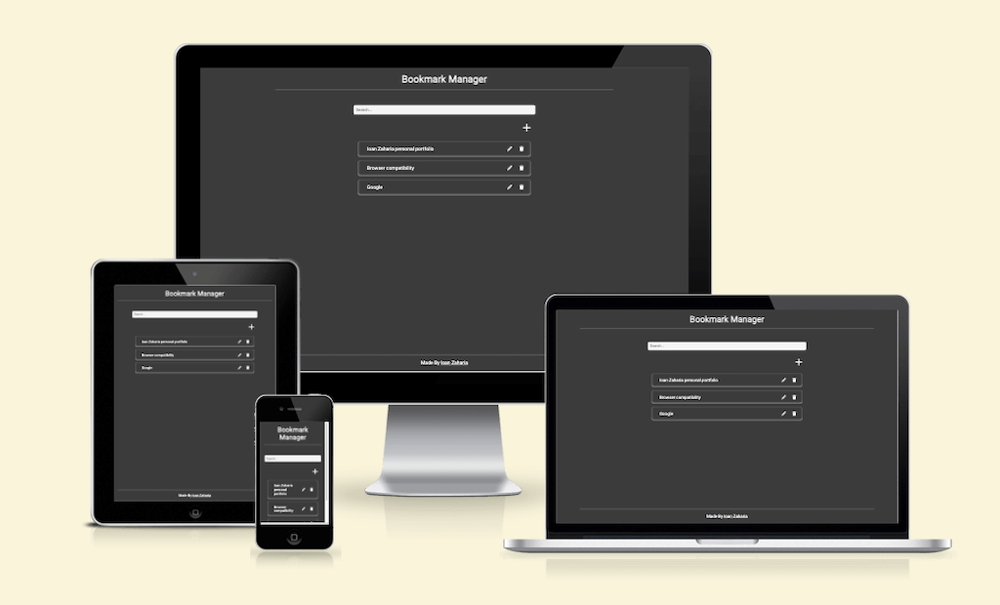
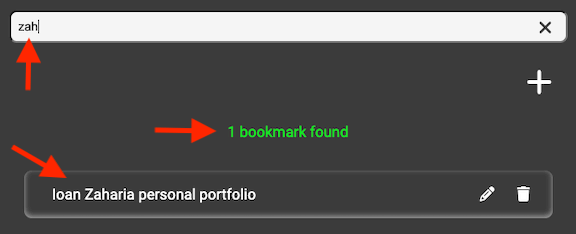
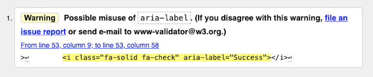
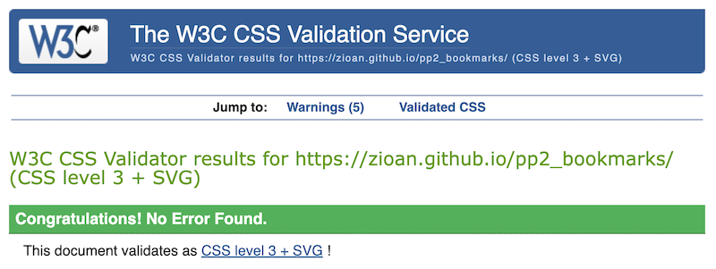

# Bookmark Manager

[Live project hosted on GitHub Pages](https://zioan.github.io/pp2_bookmarks/)

The Bookmark Manager is a JavaScript application that allows users to manage their bookmarks. Users can add, edit, delete, and search bookmarks. The application stores bookmark data locally using the browser's localStorage.

## Table of Contents

1. [Bookmark Manager](#bookmark-manager)
   - [User Story](#user-story)
   - [Acceptance Criteria](#acceptance-criteria)
   - [Additional Notes](#additional-notes)
2. [Features](#features)
3. [Usage](#usage)
4. [Technologies Used](#technologies-used)
5. [Key Functionalities](#key-functionalities)
6. [Manual Testing and Validation](#manual-testing-and-validation)
   - [Performance Testing with Lighthouse](#performance-testing-with-lighthouse)
   - [Accessibility Validation](#accessibility-validation)
   - [HTML and CSS Validation](#html-and-css-validation)
   - [JavaScript Validation](#javascript-validation)
   - [Browser Compatibility Testing](#browser-compatibility-testing)
7. [Bugs](#bugs)
8. [Version Control](#version-control)
9. [Deployment](#deployment)
10. [Credits](#credits)

## Features

- **Demo Data**: The application provide demo data for the first load for testing purpose.

- **Save Bookmarks**: Add new bookmarks by providing a URL and a title.

  

- **Edit and Delete Bookmarks**: Modify the URL and title, and remove unwanted bookmarks from collection.

  

  

- **Search Bookmarks**: Quickly find bookmarks by searching for keywords in their titles.

  

- **Bookmark Validation**: Ensures that bookmarks have valid URLs and non-empty fields.

  

  

  

- **Local Storage**: Bookmarks are stored locally in the browser, so the data persists across sessions.
- **Responsive Design**: The application is optimized for various screen sizes and devices.

## User Story

As a frequent internet user who often discovers interesting websites and resources, I want to organize and manage my bookmarks effectively, so that I can easily access them later and stay productive.

### Acceptance Criteria

- As a user, I can add new bookmarks by providing the URL and a descriptive title.
- I should be able to edit the titles or URLs of existing bookmarks if needed.
- It's essential for me to remove bookmarks that I no longer need.
- I need the ability to search through my bookmarks by title to quickly find what I'm looking for.
- The application should provide a responsive design.
- I expect the application to be intuitive and user-friendly, with clear instructions on how to use its features.

### Additional Notes

- It would be helpful to have features such as bookmark categorization or tagging to further organize my bookmarks.
- Integration with third-party bookmark syncing services like Google Chrome Sync or Firefox Sync would enhance the usability of the application.

## Usage

1. To add a new bookmark, enter the URL and title in the respective input fields, then click the "Save" button.
2. To edit a bookmark, click the pencil icon next to the bookmark you want to modify. Update the URL and title, then click "Update".
3. To delete a bookmark, click the trash icon next to the bookmark you want to remove, then confirm the deletion.
4. To search for bookmarks, start typing in the search input field. The list will dynamically update to show matching bookmarks.
5. To clear the search, click the "X" button or delete the text from the search input field.

## Technologies Used

### Languages

- **HTML**: Used for creating the structure and layout of the web application.
- **CSS**: Used for styling and design, enhancing the visual appearance of the application.
- **JavaScript**: Used to implement the core functionality of the bookmark manager application.

## Key Functionalities

- **Custom DOM Cache**: The Bookmark Manager utilizes a custom DOMCache object for caching DOM elements, improving performance by reducing repetitive code in retrieving elements from the document. This object enhances maintainability and readability while optimizing the application's efficiency.

- **Search Functionality**: The Bookmark Manager features a search functionality, allowing users to quickly find bookmarks by title. Search results are dynamically updated as users type their query, providing real-time feedback and enhancing usability.

- **Local Storage Integration**: Bookmark data is securely stored locally in the user's browser using the localStorage API. This integration enables data persistence across sessions, ensuring that users' bookmarks are retained even after closing and reopening the application.

- **URL Validation and Feedback**: During bookmark creation or update, the application validates the URL to ensure it is correctly formatted and functional. Users receive immediate feedback if the URL is incorrect or if any fields are left empty, enhancing data integrity and user experience. A visual feedback icon indicate successful operations.

## Manual Testing and Validation

### Performance Testing with Lighthouse

Mobile

Desktop

### Accessibility Validation

The Bookmark Manager application prioritizes accessibility to ensure inclusivity for all users. Accessibility features were thoroughly tested and validated, meeting industry standards for web accessibility.

#### Accessibility Warning: Possible Misuse of aria-label

The HTML validator raised a warning regarding the potential misuse of the aria-label attribute on some icon elements.

The aria-label attribute is used to provide an accessible label for elements that may not have a visible text label or have a non-descriptive label. It is intended to improve accessibility for users who rely on screen readers or other assistive technologies.

In this case, the warning suggests that the use of aria-label on the icon element may not be appropriate or necessary. The validator considers it a potential misuse because the icon itself (fa-solid fa-check) is likely meant to convey a visual representation of "success," and the aria-label attribute is redundant or may not accurately describe the icon's purpose.

To address this warning, I have removed the aria-label attribute from some icon elements. This approach aligns with the validator's recommendation and ensures that the HTML markup adheres to best practices for accessibility.

It's important to note that while the validator raised a warning, the decision to use or remove aria-label on icon elements can be subjective and may depend on the specific context and purpose of the icon. In some cases, providing an aria-label for icons can enhance accessibility, but it should be used judiciously and accurately describe the icon's purpose or function.

By removing the aria-label attribute from the icon elements, I have addressed the validator's warning and ensured that my HTML markup follows accessibility guidelines more closely.

### HTML and CSS Validation

[HTML validation](https://validator.w3.org/nu/?doc=https%3A%2F%2Fzioan.github.io%2Fpp2_bookmarks%2F)

[CSS validation](https://jigsaw.w3.org/css-validator/validator?uri=https%3A%2F%2Fzioan.github.io%2Fpp2_bookmarks%2F&profile=css3svg&usermedium=all&warning=1&vextwarning=&lang=en)

### JavaScript Validation

Each JavaScript function within the Bookmark Manager application was meticulously tested for errors and functionality using the browser console and [JSHint](https://jshint.com/) tool. This rigorous testing process ensures the reliability and efficiency of the JavaScript codebase.

### Browser Compatibility Testing

The Bookmark Manager application underwent comprehensive browser compatibility testing across various web browsers, including:

- Google Chrome
- Mozilla Firefox
- Safari
- Microsoft Edge

Browser testing ensures that the application functions seamlessly and maintains consistent performance across different browsers, enhancing user experience and accessibility.

## Bugs

### URL Validation Bug in Safari

Description:
In Safari, the reportValidity method does not work as expected when used with input fields of type "url". This method is designed to trigger the browser's built-in validation UI and return a boolean indicating whether the field's value meets its constraints. While this works correctly in most modern browsers (e.g., Chrome, Firefox, Edge), Safari does not properly validate URLs using reportValidity.

Symptoms:
When using the reportValidity method for URL input fields in Safari, valid URLs may not be recognized as valid, and the default browser notification for invalid fields is not triggered. This issue prevents users from submitting forms or proceeding with actions that rely on valid URL input.

Solution:
To address this issue, a custom validation function was implemented to handle URL validation specifically for Safari. The solution involves:

1. Browser Detection:

- Detecting if the current browser is Safari by checking the user agent string.

2. Custom URL Validation:

- Implementing a custom function isValidUrl that attempts to create a new URL object from the input value and checks its protocol. This method is used if the browser is detected as Safari.

3. Conditional Validation Logic:

- For Safari: Using the custom isValidUrl function and checking the URL.
- For other browsers: Using the reportValidity method to validate the fields.

Code Implementation:

By implementing this solution, I ensure that URL and title validation works consistently across all browsers, including Safari. The custom validation function provides a fallback mechanism for Safari, improving the overall user experience and reliability of the application.

## Version Control

### My Git Workflow

Throughout the development process, I utilized basic Git commands to manage version control effectively. I created a new repository on [GitHub](https://github.com/zioan) to host the application using [Code Institute template for GitPod](https://github.com/Code-Institute-Org/gitpod-full-template) . All necessary files were included in the repository. Here are the main commands I used:

- git add 'file_name': Added specific files to the staging area before committing changes.
- git add.: To add all files to the staging area before committing changes.
- git commit -m "commit message": Commited the staged changes with descriptive messages to track the progress of the project.
- git push: Pushed local commits to the remote repository on GitHub, ensuring that the latest changes were synchronized with the online repository.
  By employing these commands, I maintained a structured and organized version control system.

## Deployment

### Hosting on GitHub Pages

For deploying the application, I utilized [GitHub Pages](https://pages.github.com/). Here's how I deployed the application:

1. GitHub Pages Configuration: In the repository settings, I navigated to the "GitHub Pages" section and selected the main branch as the source for deployment.

2. Commit and Push: After ensuring that all changes were committed locally using git add and git commit, I pushed the commits to the remote repository using git push. This action triggered GitHub Pages to automatically build and deploy the application.

## Credits

A special thanks to my mentor, Spence.

- The screenshot with different devices was made using [Am I Responsive](https://ui.dev/amiresponsive).

- The favicon was made using [favicon.io](https://favicon.io/).

- [MDN Web Docs](https://developer.mozilla.org/): Valuable reference for JavaScript documentation, including event handling, DOM manipulation, local storage, form validation, and error handling techniques.

- [CSS-Tricks](https://css-tricks.com/): Helpful resource for CSS styling and responsive design principles.

- [W3Schools](https://www.w3schools.com/): Comprehensive references for HTML, CSS, and JavaScript, providing insights into various programming concepts and techniques used in the project.

- [Can I Use](https://caniuse.com/): Essential resource for checking browser compatibility and understanding web technology support across different browsers.

- The implementation of URL validation was influenced by an informative [article](https://www.freecodecamp.org/news/how-to-validate-urls-in-javascript/) found on FreeCodeCamp.org.

- The implementation of isSafari function to check if the browser is Safari was influenced by this [thread](https://stackoverflow.com/questions/7944460/detect-safari-browser) on StackOverflow.

- Beyond the two implementations mentioned above, I didn't directly utilize code from other sources. My previous professional experience as a web developer and the learning materials from Code Institute was the main source of knowledge in building this application.

[Back to Top](#bookmark-manager)
